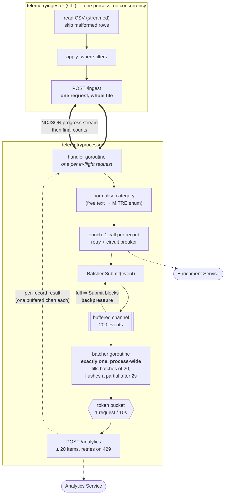

# SecOps Telemetry Ingestion

Go monorepo for ingesting SecOps malicious-activity CSV logs into the Analytics
Service

```
apps/
  telemetryingestor/     CLI — reads the CSV file, calls telemetryprocessor
  telemetryprocessor/    microservice — enriches records, forwards to Analytics Service
libs/
  category/              shared — free-text category → the Enrichment Service's enum
```

`libs/category` is a module of its own rather than an `internal/` package of
either app because both need the _same_ answer: the processor uses it to decide
what to send upstream, and the CLI's `validate` uses it to warn "the processor
will drop this record". That warning is only true while the two agree, so a
single copy is a correctness requirement rather than housekeeping.

**[docs/DESIGN.md](docs/DESIGN.md)** covers the architectural decisions, the
trade-offs behind them, and the known gaps.

## Pipeline



### How the concurrency is arranged

| Stage          | Goroutines           | Notes                                                             |
| -------------- | -------------------- | ----------------------------------------------------------------- |
| CLI            | 1                    | Reads, filters, sends, waits. Deliberately dull.                  |
| Ingest handler | 2 per HTTP request   | A producer (normalise → enrich → submit) and a consumer that settles records in order and streams progress back. |
| Enrichment     | inside the handler   | **Not** parallelised — see below.                                 |
| Batcher        | exactly 1            | Owns all batching; the only writer to the Analytics client.       |
| Rate limiter   | shared token bucket  | One token per _request_, 429 retries included.                    |

Two design points carry most of the weight:

- **Batching is process-wide, not per request.** The Analytics Service charges a
  full 10 s window per request no matter how full it is, so batch size _is_
  throughput. If each HTTP request batched its own records, two clients posting
  25 each would burn four windows on 50 records instead of three. One shared
  batcher makes the client's request size irrelevant — which is why the CLI does
  not chunk at all.
- **No worker pool for enrichment.** The pipeline is capped at 20 records / 10 s
  = 2 records/s, while enrichment costs ~50 ms/record. Twenty records enrich in
  ~1 s, comfortably inside one window. Fanning out would add goroutines,
  ordering problems and error-handling surface for exactly zero throughput.

Backpressure needs no explicit mechanism: `Submit` blocks on a full channel, so
a large ingest is paced by the rate limit instead of piling up in memory.

### The bottleneck

`1 request / 10 s × 20 items` = **20 records / 10 s**, so the 999-row sample
file takes ~8.5 minutes end to end. No amount of client-side concurrency changes
that number, which is why the CLI reports an estimate up front and derives its
HTTP timeout from the record count rather than using a fixed value.

The honest next step for production is to stop modelling this as one synchronous
call: have `/ingest` return `202 Accepted` with a job id and drain the queue in
the background.

## Toolchain

Go version is pinned via [mise](https://mise.jdx.dev) in
[.mise.toml](.mise.toml).

NOTE: If you don't have mise installed yet:

```bash
curl https://mise.run | sh

# Alternatively
brew install mise
```

```bash
mise install                 # installs the pinned Go version (and air, for hot reload)
mise run build-cli           # builds bin/telemetryingestor
mise run build-processor     # builds bin/telemetryprocessor
mise run run-processor       # runs the microservice on :8080
mise run dev-processor       # runs the microservice with hot reload (air), see .air.toml
mise run test                # go test across every module in the workspace
mise run vet                 # go vet across every module in the workspace
```

Without mise, the equivalent plain `go` commands work too, e.g.:

```bash
go run ./apps/telemetryingestor ingest -file docs/example_data_2.csv
go run ./apps/telemetryprocessor/cmd/server
```

## CLI (`telemetryingestor`)

The CLI has `ingest`, `validate`, and `filter` subcommands. Full usage, flags,
the filter language, configuration precedence, and stated assumptions are
documented in
[apps/telemetryingestor/README.md](apps/telemetryingestor/README.md).

## Microservice (`telemetryprocessor`)

The processor exposes a single `POST /ingest` endpoint. For each record it
normalises the free-text category, enriches it via the Enrichment Service
(retries + circuit breaker for the known intermittent failures), and forwards
the result to the rate-limited Analytics Service (a shared batcher that keeps
every upstream request full, plus a token-bucket limiter honouring the 1 request
of ≤ 20 items per 10 s cap). Endpoints, the API key, and all retry/rate-limit
tuning are overridable from environment variables — see
[apps/telemetryprocessor/README.md](apps/telemetryprocessor/README.md).
